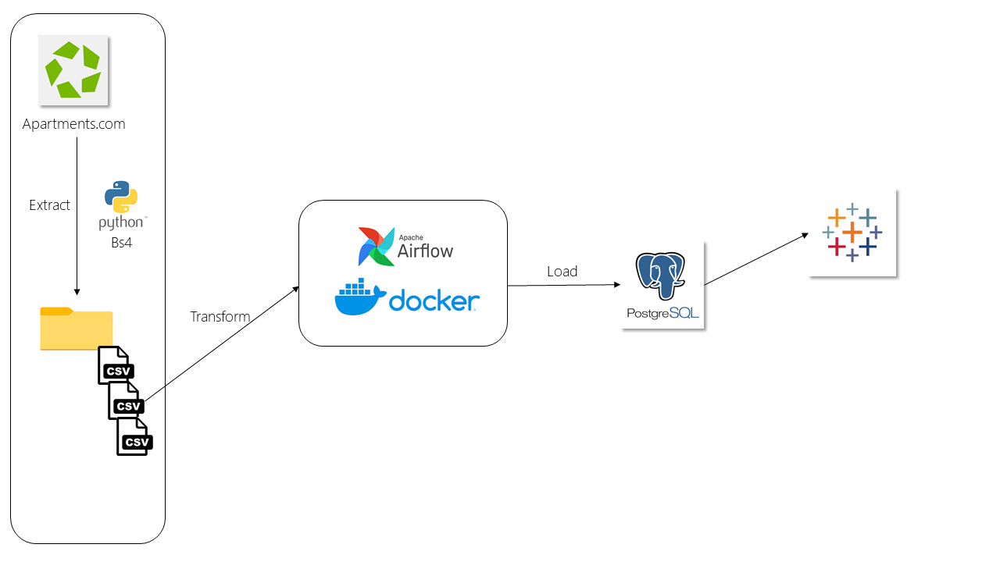
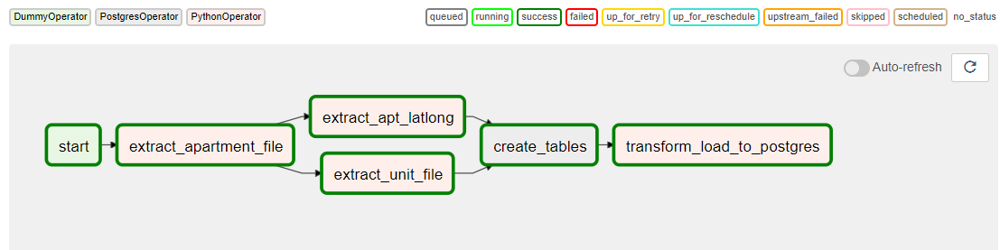

HOUSTON-APARTMENTS.COM

DESCRIPTION:
Tracking and analyzing the apartment prices in Houston, TX by creating a Datawarehouse hosted in PostgreSQL and running Airflow in Docker for orchestration. Finally, visualized the information in Tableau to see the information.

ETL DATA FLOW–
1.	Houston Apartment data is collected from the Apartment.com website by using python library beautifulsoup.
2.	The Data is stored as a CSV file format in a stage local folder.
3.	Then the raw data is processed and uploaded to multiple tables in Postgres Database.
4.	Finally, the data is analyzed and visualized in tableau. 
 

DAG and Airflow Operators: 

1.	Extract all the apartment information located in Houston, TX by using the Python Operator.
2.	From the apartment file, we will read URLS to extract the location and unit information of each apartment complex. 
    (Please note some apartments do not provide unit information.)
3.	For the first time we will create the tables with constraints and keys using Postgres Operator.
4.	Then transform the CSV files and load the data to Postgres.

Dashboard - Tableau: 
 
